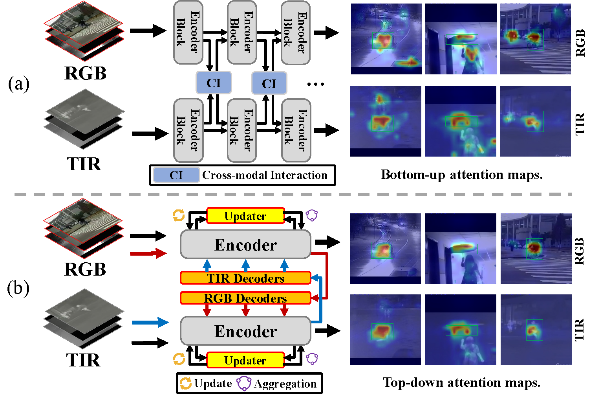
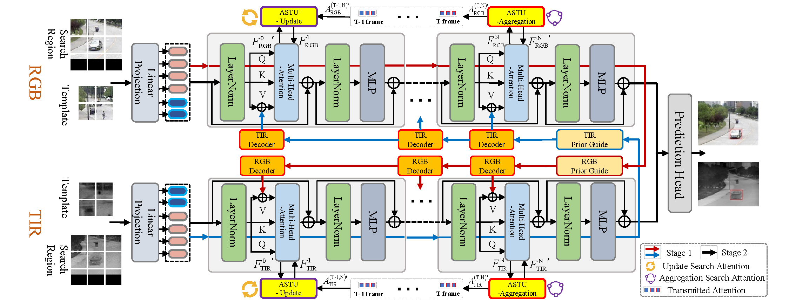
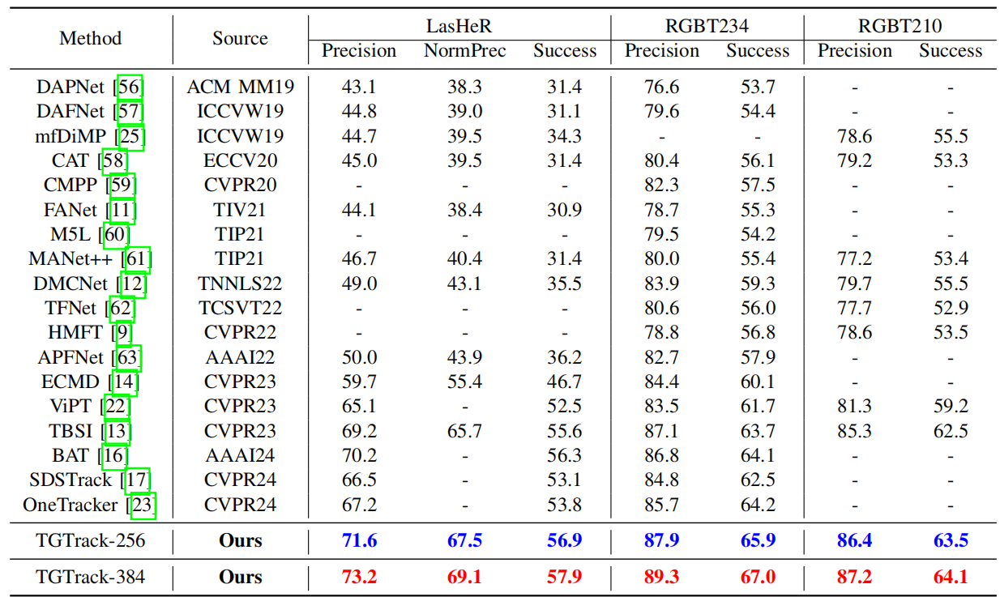
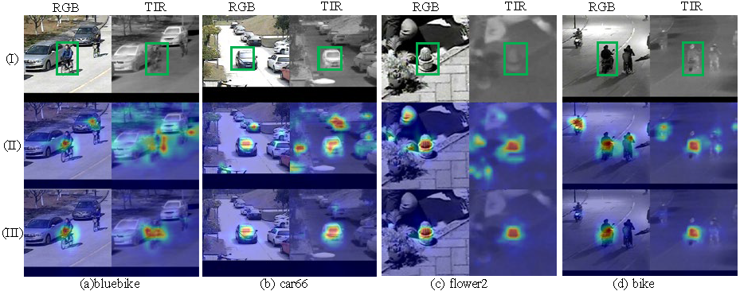
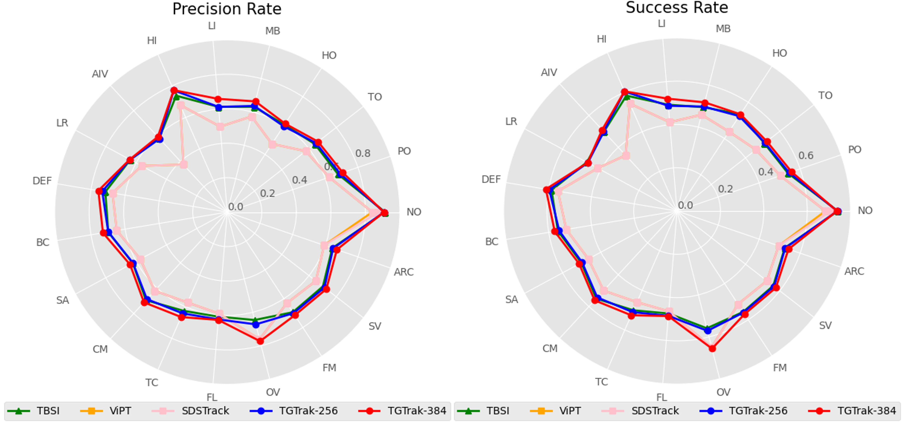

# Top-down Cross-modal Guidance for Robust RGB-T Tracking (TGTrack)

The official implementation for the **TCSVT 2024** paper [Top-down Cross-modal Guidance for Robust RGB-T Tracking](https://ieeexplore.ieee.org/document/10614652)

<p align="center">
  
</p>

This paper presents a Top-down Cross-modal Guidance mechanism to address the problem of weak discriminative power in target features learned due to the reliance on bottom-up attention in most current trackers. And a updater is proposed to help the tracker better update target features.

## Pipeline




## Resuts on LasHeR, RGBT234 and RGBT210



## Visualization


<p align="center">
  
</p>

<p align="center">
  
</p>

## Citation: 
```
@article{chen2024top,
  title={Top-down Cross-modal Guidance for Robust RGB-T Tracking},
  author={Chen, Liang and Zhong, Bineng and Liang, Qihua and Zheng, Yaozong and Mo, Zhiyi and Song, Shuxiang},
  journal={IEEE Transactions on Circuits and Systems for Video Technology},
  year={2024},
  publisher={IEEE}
}
```
